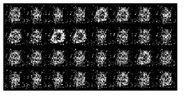
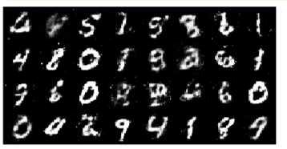
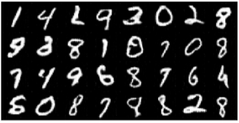
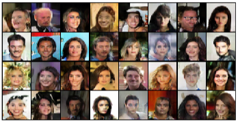
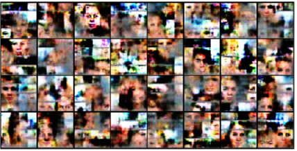
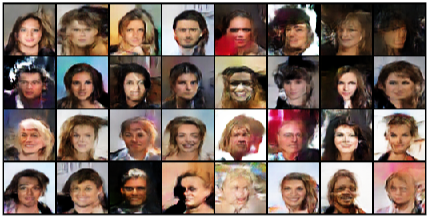
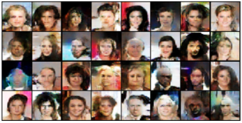

# GANs_VA

To experiment with this code you'll have to clone the repository:

```bash
git clone https://github.com/cabamarcos/GANs_VA.git
```

Then download the requirements:

```bash
pip install -r requirements.txt
```

You can download CelebA dataset [here](https://www.kaggle.com/datasets/504743cb487a5aed565ce14238c6343b7d650ffd28c071f03f2fd9b25819e6c9)

## Fully connected
First of all I created a simple fully connected PM which gave me results like this:



After some experiments with the learning rate and updating the data normalization values, it looked like this:



As you can see they look better now but they can be improved so much but they don't improve a lot if you let them train for much more time.

## DCGAN
After all I wanted to learn (this is my first implementation) so I wanted to try what it would look like if I made a CNN. 

I then searched for information that could help me to create a DCGAN, which is the GAN showed in the notebook:


I found the [paper](https://arxiv.org/pdf/1511.06434) that explains how to make it and some experiments.

After reading and understanding it I created the [document](./DCGAN.py) that contains the generator and the discriminator.

In this other [document](./TrainDCGans.py) I crated the code necessary to train the model. After 5 epochs, the generated images of the MNIST dataset look like this:



After 15 epoch, the images don't look better. In fact, some of the pixels start disappearing. I will train it more to see how time affects the creation of images.

### CelebA dataset

After training for 20 epochs, results look like this:



## WGAN

I found another [paper](https://arxiv.org/pdf/1701.07875) which explained the implementation of this GAN and the new way of training.

It basicly trains the discriminator 5 more times than the generator. 

I got results like this after 2 epochs:



In this images you can clearly see some faces forming, I will let this model train for longer so we can get better results.

After training for 5 epochs, the images generated look like this:



It doesn't get much better after more epochs.

## WGANGP

I used a different method, using gradient penalty as shown in this [paper](https://arxiv.org/pdf/1704.00028). After trying somme experiments I got this arround epoch 20:



In this images you can clearly see that they are converging into something, but I feel DCGAN generates better results
